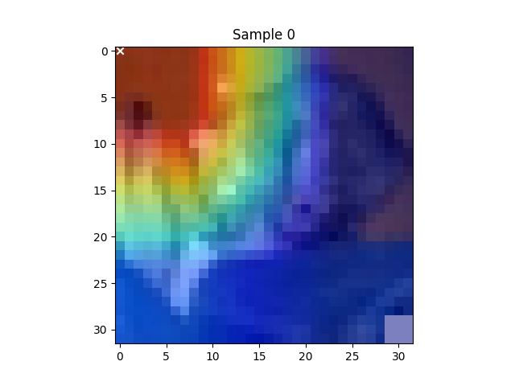
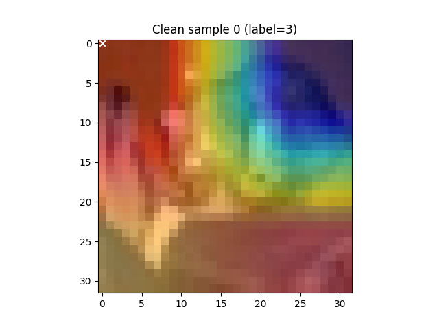

## layer2 Grad-CAM 热力图观察
- 热力图原始尺寸：32×32（已插值到原图）
- 最大值坐标：(19,19)（对应原图中心偏右下）
- 肉眼观察：
  - 主热点（红黄色）集中在图像中间偏右下区域，可能对应正常物体位置。
  - 右下角触发器位置有微弱绿色响应（中等激活），但非最高。
  - 其他区域为蓝色（低激活）。
- 图片路径：`figures/0221/gradcam_layer2.png`
## layer3 Grad-CAM 多样本分析
- **后门样本**（20个）
  - 脚本：`multi_sample_gradcam.py`
  - 结果：所有 20 个样本的热力图最大值均在 (0,0)（左上角）。
{
loading...
将处理 20 个样本
样本 0: 最大值位置 (0, 0)
样本 1: 最大值位置 (0, 0)
样本 2: 最大值位置 (0, 0)
样本 3: 最大值位置 (0, 0)
样本 4: 最大值位置 (0, 0)
样本 5: 最大值位置 (0, 0)
样本 6: 最大值位置 (0, 0)
样本 7: 最大值位置 (0, 0)
样本 8: 最大值位置 (0, 0)
样本 9: 最大值位置 (0, 0)
样本 10: 最大值位置 (0, 0)
样本 11: 最大值位置 (0, 0)
样本 12: 最大值位置 (0, 0)
样本 13: 最大值位置 (0, 0)
样本 14: 最大值位置 (0, 0)
样本 15: 最大值位置 (0, 0)
样本 16: 最大值位置 (0, 0)
样本 17: 最大值位置 (0, 0)
样本 18: 最大值位置 (0, 0)
样本 19: 最大值位置 (0, 0)
}

  - 示例热力图：

- **干净样本**（10个）
  - 脚本：`gradcam_clean.py`
  - 结果：所有 10 个样本的热力图最大值也均在 (0,0)。
{
loading...
干净样本 0 (真实标签=3): 最大值位置 (0, 0)
干净样本 1 (真实标签=8): 最大值位置 (0, 0)
干净样本 2 (真实标签=8): 最大值位置 (0, 0)
干净样本 3 (真实标签=0): 最大值位置 (0, 0)
干净样本 4 (真实标签=6): 最大值位置 (0, 0)
干净样本 5 (真实标签=6): 最大值位置 (0, 0)
干净样本 6 (真实标签=1): 最大值位置 (0, 0)
干净样本 7 (真实标签=6): 最大值位置 (0, 0)
干净样本 8 (真实标签=3): 最大值位置 (0, 0)
干净样本 9 (真实标签=1): 最大值位置 (0, 0)
}
  - 示例热力图：

- **结论**：layer3 存在系统性偏置，所有样本（无论是否后门）的最大值均落在左上角，无法用于区分后门。