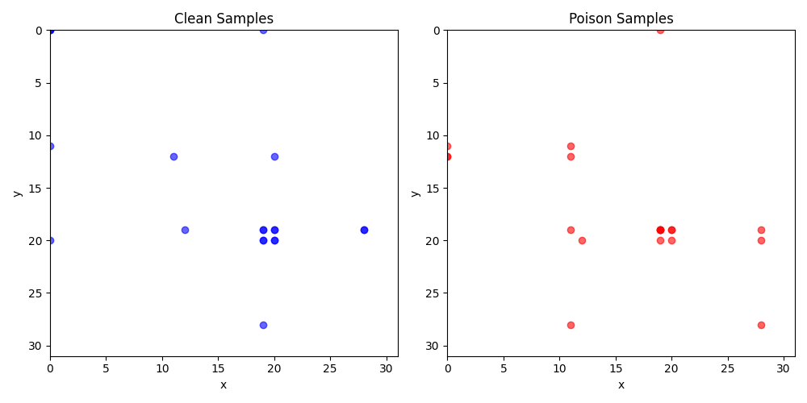
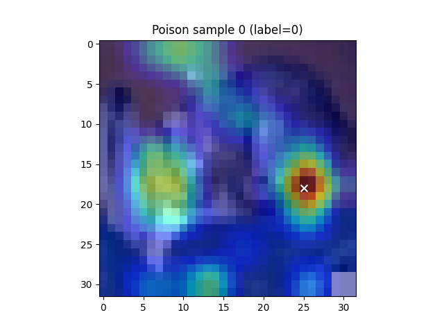
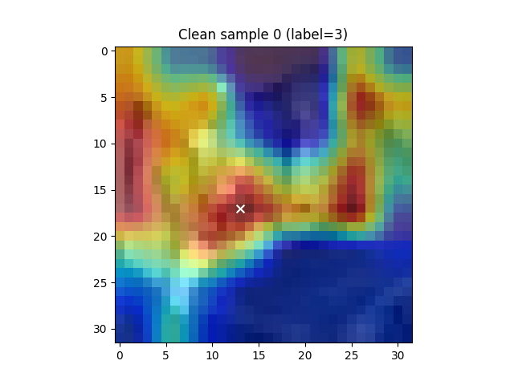

## 2026-02-22 更新

### WaNet 特征提取与 AUC 比较
- 提取脚本: `extract_layer_features_wanet.py`
- 比较脚本: `compare_layers_wanet.py`
- 结果:
  - layer1: 1.0000 ± 0.0000
  - layer2: 1.0000 ± 0.0000
  - layer3: 1.0000 ± 0.0000
  - layer4: 1.0000 ± 0.0000
- 结论: WaNet 同样表现出完美的特征可分性，验证了“通道型后门”的普遍性。
## layer2 Grad-CAM 多样本对比
- **后门样本**（20个）坐标分布（来自 `multi_sample_gradcam_layer2.py`）：
  - (0,19): 1 次
  - (11,0): 1 次
  - (11,11): 1 次
  - (12,0): 2 次
  - (12,11): 1 次
  - (19,11): 1 次
  - (19,19): 4 次
  - (19,20): 2 次
  - (19,28): 1 次
  - (20,12): 1 次
  - (20,19): 1 次
  - (20,20): 1 次
  - (20,28): 1 次
  - (28,11): 1 次
  - (28,28): 1 次
- **干净样本**（20个）坐标分布（来自 `gradcam_clean_layer2.py`）：
  - (0,0): 3 次
  - (0,19): 1 次
  - (11,0): 1 次
  - (12,11): 1 次
  - (12,20): 1 次
  - (19,12): 1 次
  - (19,19): 2 次
  - (19,20): 2 次
  - (19,28): 2 次
  - (20,0): 1 次
  - (20,19): 2 次
  - (20,20): 2 次
  - (28,19): 1 次
- **量化指标**（来自 `compare_layer2_distributions.py`）：
  - JS散度（8×8网格）：0.2937
  - 质心距离均值差置换检验：p = 0.4726（无显著差异）
- 散点对比图： （如果图片存在，否则可删除此行）

## layer1 Grad-CAM 3×3 网格分析
- 将 32×32 热力图最大值坐标映射到 3×3 网格（每个网格约 10.67×10.67 像素），统计分布如下：

  **后门样本**（20个）：
  - 原始坐标列表：
    (18,25), (17,0), (25,25), (14,14), (26,26), (18,17), (26,10), (5,18), (10,17), (17,14),
    (13,26), (13,9), (21,13), (17,17), (10,14), (14,6), (13,30), (14,21), (14,14), (0,22)
  - 映射到 3×3 网格（行 = floor(y * 3 / 32), 列 = floor(x * 3 / 32)）后的频次：
    - (0,0): 0
    - (0,1): 3（(5,18), (10,17), (10,14) → 行0,列1）
    - (0,2): 1（(0,22) → 行0,列2）
    - (1,0): 3（(17,0), (13,9), (14,6) → 行1,列0）
    - (1,1): 7（(14,14), (18,17), (17,14), (21,13), (17,17), (14,21), (14,14) → 行1,列1，注意 (14,14) 出现两次）
    - (1,2): 3（(18,25), (13,26), (13,30) → 行1,列2）
    - (2,0): 1（(26,10) → 行2,列0）
    - (2,1): 0
    - (2,2): 2（(25,25), (26,26) → 行2,列2）

  **干净样本**（20个）：
  - 原始坐标列表：
    (17,13), (17,22), (26,9), (22,17), (22,0), (6,14), (25,10), (17,6), (26,6), (10,14),
    (6,10), (25,18), (25,10), (13,10), (21,14), (18,17), (9,14), (14,6), (30,30), (17,22)
  - 映射到 3×3 网格后的频次：
    - (0,0): 0
    - (0,1): 4（(6,14), (10,14), (6,10), (9,14) → 行0,列1）
    - (0,2): 0
    - (1,0): 3（(17,6), (13,10), (14,6) → 行1,列0）
    - (1,1): 3（(17,13), (21,14), (18,17) → 行1,列1）
    - (1,2): 2（(17,22), (17,22) 两次 → 行1,列2）
    - (2,0): 5（(26,9), (22,0), (25,10), (26,6), (25,10) → 行2,列0，注意 (25,10) 两次）
    - (2,1): 2（(22,17), (25,18) → 行2,列1）
    - (2,2): 1（(30,30) → 行2,列2）

- **观察**：后门样本在中心网格 (1,1) 出现 7 次（35%），干净样本在底部网格 (2,0) 出现 5 次（25%），存在一定偏移，但无统计显著性检验。
- 示例热力图：  